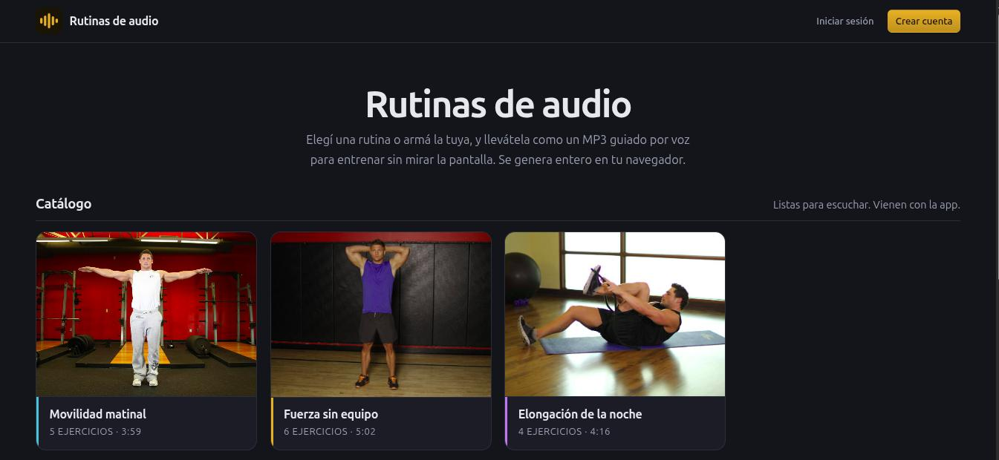
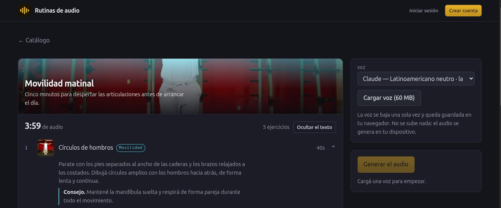

# Rutinas de audio

Convierte una rutina de ejercicio en un **MP3 guiado por voz**, para entrenar sin mirar la pantalla.

Lo particular es dónde corre: **no hay servidor**. La red neuronal que sintetiza la voz, el armado de la pista y la codificación del MP3 pasan enteros en el navegador de quien usa la página. No hay API keys que administrar, no hay costo que crezca con los usuarios, y ni las rutinas ni el audio salen del dispositivo.

Es la versión web de [audios-de-entrenamiento](https://github.com/agustingodoyc/audios-de-entrenamiento), un script de Python que hacía lo mismo desde la terminal.



**En línea:** <https://rutinas-de-audio.agustin-godoy-cosser.workers.dev>

## Arrancar

```bash
npm install
npm run dev
```

Y abrir la URL que imprime Vite. La primera vez que generes un audio se bajan unos 78 MB (60 del modelo de voz y 18 del pronunciador de espeak-ng); después queda todo cacheado en el navegador.

```bash
npm test          # tests del armado de la pista y de la fusión, sin navegador
npm run build     # typecheck + build de producción
npm run imagenes  # baja las fotos de los ejercicios (una sola vez)
```

## Cómo funciona

```
Rutina  →  Piper (ONNX en WASM)  →  Web Audio  →  lamejs  →  MP3
```

Todo dentro de un Web Worker, así la interfaz no se congela mientras genera.

Cada ejercicio se arma como tres bloques concatenados:

| Bloque | Duración | Contenido |
|---|---|---|
| Anuncio | 2 s | «Ahora, *{nombre}*.» |
| Ejecución | `seg` | Nombre e instrucciones en loop a 1,25×, con fundido de 500 ms |
| Preparación | 3 s | «Próximo ejercicio. *{siguiente}*.» |

Si el ejercicio tiene `cambioLado`, a la mitad exacta del bloque de ejecución se inserta un aviso de 2 s.

El motor salió de un *spike*: una página desechable que validó que todo esto
era posible en un navegador antes de escribir la app. Lo que se aprendió ahí
—incluida la razón por la que este proyecto no puede vivir en GitHub Pages—
está en [`docs/spike.md`](docs/spike.md).

### Lo que hay que saber antes de tocar el motor

Está todo en `public/audio-worker.js`, y vive fuera del build de Vite a propósito: `importScripts` necesita archivos servidos tal cual. Cuatro cosas que se descubrieron midiendo y que no son evidentes leyendo el código:

La velocidad de las instrucciones es `VELOCIDAD_INSTRUCCIONES` en
`public/audio-worker.js`. Está en 1,25×, después de probar 2× y 1,5×: el punto
no es que se entiendan, es poder seguirlas mientras estás haciendo el
ejercicio, y ahí el margen es más chico de lo que parece leyendo el texto en
una pantalla. Los anuncios y las preparaciones no usan ese número — se aceleran
sólo lo necesario para entrar en su caja, hasta 1,6×.

**`length_scale` no es lineal.** Piper predice cuántos frames dura cada fonema y redondea hacia arriba con un mínimo de uno, así que pedir 2× no devuelve 2×: la curva satura. Con `es_MX-claude-high` el techo real es 2,38×; con la voz liviana, 1,68×. Por eso el motor mide la curva una vez por voz y la invierte, en vez de creerle al número que le pide al modelo.

**`noise_w` va en cero.** Piper también mete ruido en la predicción de duración, así que la misma frase dura distinto en cada síntesis. Con ruido, encajar bloques es una lotería y el cache de frases no sirve de nada.

**Los textos de más de una oración necesitan atención.** El fonemizador devuelve una secuencia de fonemas por oración. Quedarse con la primera —que es lo que hace la librería `vits-web`— sintetiza sólo un tercio de una instrucción de tres oraciones. Hay que sintetizar cada una y concatenar el audio.

**El MP3 se codifica por bloques.** Veinte minutos de pista en `Float32Array` serían unos 106 MB en RAM y un celular de gama media no los aguanta. Los bloques se codifican y se sueltan a medida que se arman: el pico medido fue de 3,3 MB y no crece con la duración de la rutina.

### Por qué la síntesis usa un solo hilo

ONNX Runtime puede usar varios hilos, pero para eso necesita `SharedArrayBuffer`, que el navegador sólo habilita en páginas con cross-origin isolation:

```
Cross-Origin-Opener-Policy: same-origin
Cross-Origin-Embedder-Policy: credentialless
```

Esos dos headers estuvieron puestos y hoy están apagados, en `vite.config.ts` y en `public/_headers`.

El motivo: activarlos no afecta sólo a la página, sino a **todo lo que la página baja de otros dominios**. Cada respuesta ajena tiene que cumplir la política, y huggingface.co —de donde sale el modelo de voz— dejó de cumplirla. El síntoma era un `Failed to fetch` al cargar la voz y una app completamente inutilizable: se ganaba velocidad en una síntesis que nunca llegaba a correr.

Medido desde la consola de la propia página, con los headers puestos:

| Dominio | Resultado |
|---|---|
| cdnjs (ONNX Runtime) | 200 |
| jsDelivr (fonemizador) | 200 |
| raw.githubusercontent | 200 |
| **huggingface.co** | `Failed to fetch` |

Sin los headers, ese mismo pedido a Hugging Face devuelve 200.

Para recuperar los hilos hay que servir el modelo desde un dominio que sí cumpla: subirlo a un repositorio propio y bajarlo de `raw.githubusercontent.com`, o pasarlo por el propio Worker de Cloudflare y volverlo same-origin. Cualquiera de las dos permite volver a encender los headers, que están comentados esperando ese día.

El worker pide un hilo o varios según `crossOriginIsolated`, así que el código ya funciona de las dos formas sin tocar nada.

## Estructura

```
public/
  audio-worker.js      El motor completo. JS puro, sin build.
  sw.js                Service worker: la app sin conexión
  _headers             COOP/COEP para Cloudflare Pages
  manifest.webmanifest
  iconos/
  ejemplos/            Muestras pregeneradas + indice.json
  ejercicios/          Fotos del catálogo + creditos.json
src/
  datos/
    catalogo.json      Ejercicios y rutinas que trae la app
    almacen.ts         IndexedDB
    intercambio.ts     Importar/exportar en el formato de Python
    useBiblioteca.ts   Catálogo + lo que cargó el usuario
    fotos.ts           Ruta de cada foto y color por grupo
    fusion.ts          Qué versión gana al sincronizar. Sin dependencias
    supabase.ts        El cliente, o null si no está configurado
    useSesion.ts       Login con Google y sesión
    nube.ts            Bajar, subir y fusionar contra Supabase
  audio/               El hook que habla con el worker
  componentes/         UI
scripts/
  descargar-imagenes.mjs  Trae las fotos de free-exercise-db
docs/spike.md          Qué se validó antes de escribir la app
supabase/
  esquema.sql          Tablas, trigger de perfiles y políticas RLS
  migracion-01-…       Cambios al modelo, aplicados en orden
ejemplos/              JSON de muestra para probar la importación
capturas/              Imágenes de este README
tests/                 Tests del motor y de la fusión, corren en node
```

## Las dos pantallas

El catálogo es la portada: rutinas en tarjetas y nada más, porque elegir es lo
primero que hace cualquiera que entra. La voz, la generación y el reproductor
aparecen recién con una rutina elegida, que es cuando significan algo.

En la barra de arriba está la cuenta, que es **opcional**: sin iniciar sesión
la app funciona igual y todo queda en tu navegador. Con cuenta, tu biblioteca
te sigue entre dispositivos.

## Las cuentas

Sobre [Supabase](https://supabase.com): Postgres con Row Level Security y login
con Google. El esquema completo está en
[`supabase/esquema.sql`](supabase/esquema.sql) y se corre entero en el SQL
Editor del proyecto.

Para levantarlo:

```bash
npm install @supabase/supabase-js
cp .env.example .env.local   # y completar con los datos del proyecto
```

En el panel de Supabase hay que habilitar Google en *Authentication →
Providers* y agregar la URL de la app en *Authentication → URL Configuration*
(`http://localhost:5173` para desarrollo).

### Cómo sincroniza

La app es **local-first**: la fuente de verdad es IndexedDB, en el navegador.
Todo funciona sin cuenta y sin internet; la nube es una copia. Con sesión
iniciada, al entrar se fusionan las dos bibliotecas y después cada cambio se
guarda primero local y se sube segundo. Si la subida falla, el cambio no se
pierde: ya está guardado acá y se sube en la próxima fusión.

- **Gana el último que escribió.** Cada ejercicio y cada rutina llevan la fecha
  de su última modificación, y al fusionar gana la más nueva. No es perfecto:
  editar la misma rutina en dos dispositivos sin conectarse pierde una de las
  dos versiones en silencio. Resolverlo de verdad exige guardar el historial de
  cambios campo por campo, que es lo que hacen las bases distribuidas, y para
  una biblioteca de rutinas personales el costo no se justifica. Lo importante
  es que el criterio sea explícito.
- **Borrar no borra.** Deja una *lápida*: la fila sobrevive marcada como
  borrada, con su fecha. Sin eso, borrar una rutina en el celular y sincronizar
  después desde la compu —que todavía la tiene— la haría reaparecer sola.
- **La lógica de fusión no importa nada.** Vive sola en `datos/fusion.ts`,
  separada del acceso a la red: entra la lista local y la remota, sale el
  resultado. Por eso se prueba con node en milisegundos y sin simular Supabase
  —un test con mocks termina probando los mocks— y por eso los casos feos
  (empate de fechas, una versión sin fecha, una lápida más nueva que una
  edición) están cubiertos en `tests/fusion.test.mjs`.
- **Guardar una rutina es una transacción.** Son tres operaciones (la rutina,
  borrar sus pasos viejos, insertar los nuevos). Desde el navegador serían tres
  pedidos sueltos y un corte a la mitad dejaría una rutina sin ejercicios. Van
  adentro de la función `guardar_rutina()` de Postgres, que es una sola
  transacción.

### Detalles que no son obvios

- **El login es por redirección, no por popup.** La página corre con
  `Cross-Origin-Opener-Policy: same-origin` por el `SharedArrayBuffer` de ONNX,
  y con eso un popup no puede hablar con la ventana que lo abrió: el flujo de
  Google se cuelga sin decir por qué.
- **Los ids son los mismos que usa la app**, no uuid nuevos. Lo que ya está en
  IndexedDB sube tal cual y una rutina exportada es la misma de los dos lados.
  Como `propio:sentadilla` sólo es único dentro de una persona, la clave
  primaria es `(usuario_id, id)`.
- **La anon key es pública**: viaja en el JavaScript. Lo que protege los datos
  son las políticas, no el secreto de la clave. Publicar una rutina hace
  visibles sus pasos y los ejercicios que usa — el resto de la biblioteca no.

## Tu biblioteca

El catálogo que trae la app es de sólo lectura, pero cualquiera de sus rutinas se puede **copiar** a la biblioteca propia para cambiarle los tiempos, el orden o publicarla. La copia sigue apuntando a los ejercicios del catálogo en vez de duplicarlos, así que publicarla sube la secuencia y nada más. Aparte de eso podés armar tus propias rutinas y cargar tus propios ejercicios: viven en **IndexedDB**, en tu navegador, y no salen de ahí. No hay cuentas ni servidor donde guardarlas.



*Cada fila se despliega y muestra lo que la voz va a leer: es la única forma de
saber qué dice un ejercicio sin generar el MP3 entero y escucharlo.*

Los botones de **Importar** y **Exportar** hablan el formato exacto de [audios-de-entrenamiento](https://github.com/agustingodoyc/audios-de-entrenamiento), el proyecto de Python:

```jsonc
// ejercicios.json
{ "Balanceo de Brazos": "INSTRUCCIONES: … CONSEJOS: …" }

// rutinas.json
{ "Pecho 1": [ { "nombre": "…", "seg": 30, "cambio_lado": false } ] }
```

Así la biblioteca personal va y viene entre los dos proyectos sin conversiones a mano. Hay archivos de muestra en `ejemplos/`.

Dos detalles del diseño de datos:

- **`cambio_lado` vive en el ejercicio, no en la entrada de la rutina.** En el formato de Python va por entrada; acá se movió al ejercicio, porque un estiramiento es por lado siempre, esté en la rutina que esté. Al importar se toma de la primera entrada que lo mencione.
- **Los ids de lo que cargás llevan prefijo** (`propio:` y `mia:`) para no chocar con el catálogo si le ponés a tu rutina el mismo nombre que una de las que vienen. Como derivan del nombre, importar dos veces el mismo archivo actualiza en vez de duplicar.

Si borrás un ejercicio que alguna rutina usaba, la rutina se genera igual salteándolo: el motor no se rompe por un id que ya no existe. La app te avisa qué rutinas lo usan antes de borrarlo.

## En el celular y sin conexión

**Se instala.** Hay `manifest.webmanifest` e íconos, así que desde el navegador del celular podés agregarla a la pantalla de inicio y se abre como una app, sin barra de direcciones.

**Funciona offline.** Un service worker (`public/sw.js`) guarda el shell de la app. El modelo de voz no pasa por ahí: lo cachea el propio `audio-worker.js` con la Cache API, porque son 60 MB que no tienen por qué competir por la cuota ni revalidarse en cada visita. Una vez que bajaste la voz, la app entera anda sin internet.

El service worker **sólo se registra en producción**. En desarrollo, uno sirviendo archivos viejos es una fuente de confusión y nada más.

**Suena con la pantalla apagada.** El MP3 se reproduce en un `<audio>` común, así que el sistema operativo lo trata como cualquier música: sigue sonando en segundo plano y los botones de los auriculares funcionan. La Media Session API le pone el nombre de la rutina y el ícono de la app a la pantalla bloqueada, en vez de mostrar la URL.

## Audios de ejemplo

La primera generación real exige bajar unos 78 MB. Alguien que entra sólo a ver de qué se trata no va a esperar eso, y con razón. Por eso la app busca muestras ya generadas en `public/ejemplos/` y, si las encuentra, ofrece escucharlas sin bajar nada.

Generarlas es un paso manual, una vez:

1. Abrí la app, cargá la voz y generá las rutinas del catálogo.
2. El archivo que se descarga ya se llama como corresponde — el id de cada rutina del catálogo es el slug de su nombre, justamente para que coincida.
3. Movelos a `public/ejemplos/`:

```bash
mv ~/Descargas/{movilidad-matinal,fuerza-sin-equipo,elongacion-de-la-noche,antes-de-la-carrera,tren-inferior,cadera-y-espalda-baja,pausa-de-escritorio}.mp3 public/ejemplos/
```

`public/ejemplos/indice.json` ya las lista a todas. Cada una se enciende sola el día que su MP3 aparece: antes de mostrar el reproductor, la app verifica que el archivo exista de verdad. No alcanza con escuchar el evento `error` del `<audio>` — cuando el archivo falta, tanto el servidor de desarrollo como un hosting con fallback a `index.html` devuelven 200 con HTML, y el reproductor se queda cargando para siempre sin avisar. Por eso se mira el `content-type`.

## Las fotos de los ejercicios

Cada ejercicio del catálogo puede tener una foto en `public/ejercicios/<id>.jpg`.
Las baja `npm run imagenes` desde [free-exercise-db](https://github.com/yuhonas/free-exercise-db)
—dominio público, unos 870 ejercicios— y deja anotado en
`public/ejercicios/creditos.json` de qué ejercicio salió cada una.

**Ninguna foto es obligatoria.** La que falta se reemplaza por una tarjeta con
el color de su grupo, y se ve deliberada, no rota. Es el mismo criterio que los
audios de ejemplo: la función se enciende sola el día que el archivo aparece.

**Lo que vendría después: ilustraciones dibujadas a mano**, una por ejercicio y
con un estilo común, en lugar de fotos de gimnasio que vienen cada una de una
sesión distinta. Sin imágenes generadas con IA — es una decisión tomada, no una
pendiente: si se dibujan, se dibujan.

El catálogo está en español y ese proyecto en inglés, así que el script lleva
una lista de nombres candidatos por ejercicio y prueba primero el nombre exacto
y después por coincidencia parcial. Los que no encuentra los informa al
terminar, con el link para buscarlos a mano. Es sobre todo un proyecto de
gimnasio: los ejercicios de movilidad son los que más suelen faltar.

Cada grupo tiene su color —movilidad, fuerza y elongación— y de ahí salen la
portada de la rutina, el punto de la lista y el borde del ejercicio que está
sonando. El grupo de una rutina es el que más se repite entre sus ejercicios.

## Publicarla

Se hospeda en **Cloudflare**, y la razón es concreta: `public/_headers`. Los
headers de cross-origin isolation no son opcionales —sin ellos ONNX corre en un
solo hilo— y GitHub Pages no deja configurarlos.

El panel de Cloudflare ya no crea proyectos de Pages: arma un **Worker que
sirve archivos estáticos** y lo publica con `npx wrangler deploy`. Ese comando
necesita `wrangler.jsonc`, que declara el directorio a publicar. Sin ese
archivo el build compila y el despliegue falla.

| Ajuste | Valor |
| --- | --- |
| Build command | `npm run build` |
| Deploy command | `npx wrangler deploy` |
| Root directory | `/` |
| Build variables | `VITE_SUPABASE_URL`, `VITE_SUPABASE_ANON_KEY` |

Las variables van en *Settings → Builds → Variables and secrets*, **no** en las
de runtime. Vite las lee **en el momento de compilar** y las deja escritas
adentro del JavaScript; una variable de runtime llega cuando el build ya pasó y
no la ve nadie. Un despliegue sin ellas produce una app sin cuentas y sin
ningún error visible: el botón de Google simplemente no hace nada.

Después del primer despliegue, en Supabase → *Authentication → URL
Configuration*:

- **Site URL**: la URL de producción.
- **Redirect URLs**: la de producción y `https://*.<proyecto>.pages.dev`, para
  que el login también funcione en los despliegues de prueba que Cloudflare
  crea por cada rama.

En Google Cloud no hay que tocar nada: la dirección de retorno registrada
apunta a Supabase, no a la app. Lo que sí hay que hacer es **publicar la
pantalla de consentimiento** (*Audience → Publish app*); mientras esté en
`Testing` sólo entran los mails cargados como test users.

## El catálogo

Los ejercicios y sus instrucciones están escritos para este proyecto: no provienen de ninguna aplicación de terceros. Para ampliarlo hay fuentes abiertas — [free-exercise-db](https://yuhonas.github.io/free-exercise-db/) es dominio público (~800 ejercicios, en inglés) y [wger](https://github.com/wger-project/wger) tiene licencia abierta con atribución.

Si sumás material de esas fuentes, la atribución que pida cada licencia va en este README.

## Créditos y licencias

- Voces y modelos: [Piper](https://github.com/rhasspy/piper) (MIT), servidos desde [Hugging Face](https://huggingface.co/diffusionstudio/piper-voices)
- Inferencia: [ONNX Runtime Web](https://github.com/microsoft/onnxruntime) (MIT)
- Fonemizador: [@diffusionstudio/piper-wasm](https://www.npmjs.com/package/@diffusionstudio/piper-wasm)
- Codificador MP3: [lamejs](https://github.com/zhuker/lamejs) — **LGPL**, cargado desde CDN sin modificar
- Fotos de los ejercicios: [free-exercise-db](https://github.com/yuhonas/free-exercise-db) (Unlicense, dominio público)

Código propio bajo licencia MIT.
